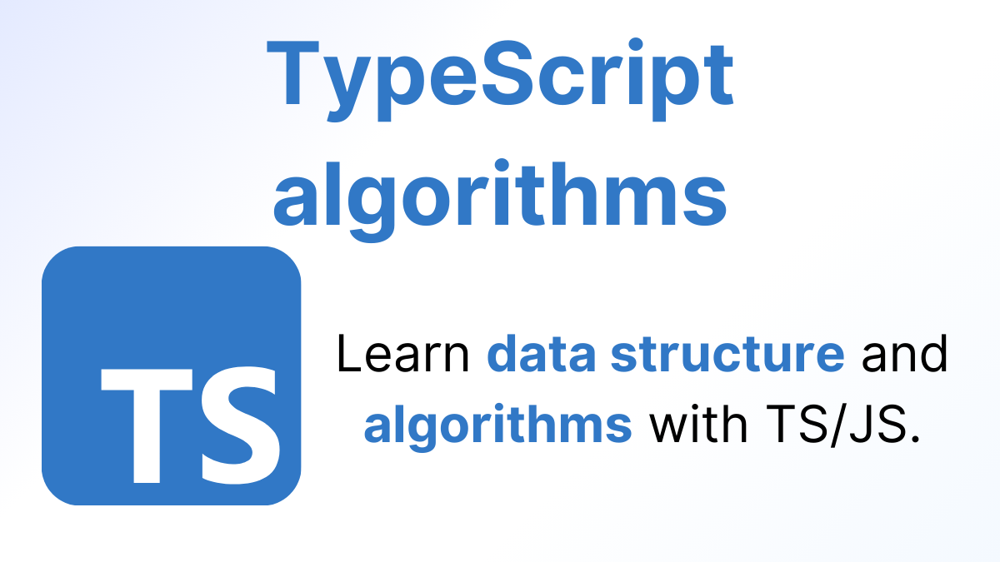

<p align="center">
  
</p>

<h3 align="center">
  TypeScript algorithms
</h3>

<blockquote align="center">Learn data structure and algorithms with TS/JS.</blockquote>
<br>

<p align="center">
  <a href="#about-the-project">About the project</a><br>
  <a href="#installation">Installation</a><br>
  <a href="#starting-the-app">Starting the app</a><br>
  <a href="#contribute">Contribute</a><br>
</p>

## About the project

The TS algorithms project was created with the intention of helping people understand algorithms and data structures using TypeScript. Many people lack the practice of studying or practicing them, and this is essential to succeed in today's technical interviews.

There are many great books for learning how to solve this type of algorithm, but with JavaScript/TypeScript, we have some additional methods that make our work easier, not to mention that we can always extract the best way to solve a problem with the language.

The idea of the project is to have more contributions and expand, to the point of being a reference guide for studies, or just the type of site that you constantly return to to make sure how to solve an exercise.

### Installation

To run the project locally, you must install the Node dependencies and ensure a Node engine version of 18 or higher. To install the modules, run the following command:

```bash
npm install
```

### Starting a server

To initiate the app, you can simply run the following command:

```bash
npm start
```

### Contribute

Contributions are extremely welcome. The project is still in its early stages, so we don't have a standard for everything yet; we're just trying to adhere to Docusaurus best practices.

To understand how to contribute, take a look at their documentation:

[Docusaurus docs](https://docusaurus.io/docs/)
