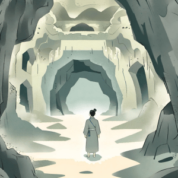

import { Editor } from '../../../src/algorithms/editor/editor'

# 4. Deciphering the Hidden Chamber



While exploring an ancient cave, you stumbled upon a series of chambers adorned with mysterious symbols. Each symbol
corresponds to a hidden chamber within the cave. Given a two-dimensional array representing the layout of symbols on
the cave walls, find the index of the chamber containing a specific symbol.

If the symbol is not found in the cave, return -1.

```typescript
const caveLayout = [
  [1, 2, 3],
  [4, 5, 6],
  [7, 8, 9]
]
const targetSymbol = 5
findChamberIndexBySymbol(caveLayout, targetSymbol)
// Expected Output: Index of the chamber with the symbol 5 (1)
```

<Editor
  editorHeight={250}
  args='[[1, 2, 3], [4, 5, 6], [7, 8, 9]], 5'
  expectedResult="1"
  initialCode={`function findChamberIndexBySymbol (caveLayout: number[][], targetSymbol: number): number {
  return -1
}`} />
