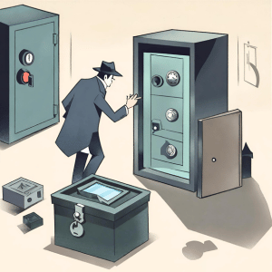

import { Editor } from '../../../src/algorithms/editor/editor'

# 5. Cracking the Safe of Suspects



You're a detective investigating a series of burglaries in a neighborhood. Each burglary involved stealing valuable
items stored in different safes. You obtained a list of suspects and the contents of their safes. Your task is to find
the suspect who stole a specific set of valuable items from their safe.

If the contents are not found in any of the safes, return -1.

```typescript
const suspectsData = [
  { id: 1, safeContents: [10, 20, 30] },
  { id: 2, safeContents: [40, 50, 60] },
  { id: 3, safeContents: [70, 80, 90] }
]
const targetContents = [40, 50, 60]
findSuspectIndexBySafeContents(suspectsData, targetContents)
// Expected Output: Index of suspect whose safe contains [40, 50, 60] (1)
```

<Editor
  editorHeight={300}
  args='[{ id: 1, safeContents: [10, 20, 30] }, { id: 2, safeContents: [40, 50, 60] }, { id: 3, safeContents: [70, 80, 90] }], [40, 50, 60]'
  expectedResult="1"
  initialCode={`type Suspect = {
  id: number
  safeContents: number[]
}

function findSuspectIndexBySafeContents (suspectsData: Suspect[], targetContents: number[]): number {
  return -1
}`} />
