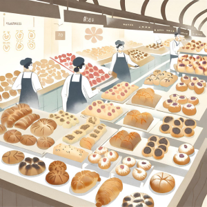

import { Editor } from '../../../src/algorithms/editor/editor'

# 2. The Bakery's Pastry Search



In a bustling bakery filled with a delightful array of pastries, each pastry is labeled with a unique code. Baker Sarah
needs to find a specific pastry on the shelf. Given an array representing the codes of the pastries in the bakery, help
Baker Sarah find the index of the pastry with the specified code.

If the specified code is not found, return -1.

:::note

This problem can be solved by linear search as well, but make sure you solve it using binary search.

:::

```typescript
const bakeryPastries = [
  'CroissantBanana', 'CroissantButtery', 'CroissantCaramel', 'Croissant2022', 'CroissantFlaky',
  'CroissantHazelnut', 'CroissantAlmond', 'CroissantOrange', 'CroissantGourmet', 'CroissantApricot',
  'DanishAlmond', 'DanishApricot', 'DanishCinnamon', 'DanishGourmet', 'DanishHazelnut',
  'DanishOrange', 'DanishButtery', 'DanishChocolate', 'DanishCranberry', 'DanishLemon',
  'EclairChocolate', 'EclairCoconut', 'EclairDelight', 'EclairMango', 'EclairRaspberry',
  'EclairButterscotch', 'EclairCaramel', 'EclairPineapple', 'EclairSpecial', 'EclairVanilla',
  'MacaronCoffee', 'MacaronHazelnut', 'MacaronLavender', 'MacaronPistachio', 'MacaronRose',
  'MacaronCinnamon', 'MacaronSpecial', 'MacaronVanilla', 'MacaronBlueberry', 'MacaronOrange',
  'SconeBlueberry', 'SconeCherry', 'SconeCranberry', 'SconeLemon', 'SconePeach',
  'SconeStrawberry', 'SconeChocolate', 'SconeCinnamon', 'SconeVanilla', 'SconeHazelnut'
]
const pastryCode = 'SconeLemon'
findPastryIndex(bakeryPastries, pastryCode)
// Expected Output: Index of pastry with code SconeLemon (43)
```

<Editor
  editorHeight={450}
  args="['CroissantBanana', 'CroissantButtery', 'CroissantCaramel', 'Croissant2022', 'CroissantFlaky','CroissantHazelnut', 'CroissantAlmond', 'CroissantOrange', 'CroissantGourmet', 'CroissantApricot', 'DanishAlmond', 'DanishApricot', 'DanishCinnamon', 'DanishGourmet', 'DanishHazelnut','DanishOrange', 'DanishButtery', 'DanishChocolate', 'DanishCranberry', 'DanishLemon','EclairChocolate', 'EclairCoconut', 'EclairDelight', 'EclairMango', 'EclairRaspberry','EclairButterscotch', 'EclairCaramel', 'EclairPineapple', 'EclairSpecial', 'EclairVanilla','MacaronCoffee', 'MacaronHazelnut', 'MacaronLavender', 'MacaronPistachio', 'MacaronRose','MacaronCinnamon', 'MacaronSpecial', 'MacaronVanilla', 'MacaronBlueberry', 'MacaronOrange','SconeBlueberry', 'SconeCherry', 'SconeCranberry', 'SconeLemon', 'SconePeach','SconeStrawberry', 'SconeChocolate', 'SconeCinnamon', 'SconeVanilla', 'SconeHazelnut'], 'SconeLemon'"
  expectedResult="43"
  initialCode={`function findPastryIndex (bakeryPastries: string[], pastryCode: string): number {
  return -1
}`} />
