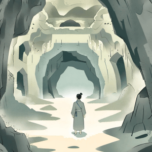

import { Editor } from '../../../../../../src/algorithms/editor/editor'

# 4. Decifrando a Câmara Oculta



Enquanto explorava uma caverna antiga, você encontrou uma série de câmaras adornadas com símbolos misteriosos. Cada
símbolo corresponde a uma câmara oculta dentro da caverna. Dada uma matriz bidimensional representando o layout dos
símbolos nas paredes da caverna, encontre o índice da câmara que contém um símbolo específico.

Se o símbolo não for encontrado na caverna, retorne -1.

```typescript
const layoutDaCaverna = [
  [1, 2, 3],
  [4, 5, 6],
  [7, 8, 9]
]
const simboloAlvo = 5
encontrarIndiceDaCamaraPeloSimbolo(layoutDaCaverna, simboloAlvo)
// Saída Esperada: Índice da câmara com o símbolo 5 (1)
```

<Editor
  editorHeight={250}
  args='[[1, 2, 3], [4, 5, 6], [7, 8, 9]], 5'
  expectedResult="1"
  initialCode={`function encontrarIndiceDaCamaraPeloSimbolo (layoutDaCaverna: number[][], simboloAlvo: number): number {
  return -1
}`} />
