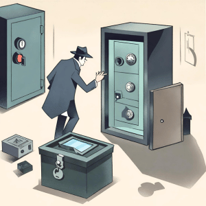

import { Editor } from '../../../../../../src/algorithms/editor/editor'

# 5. A Combinação dos Cofres



Você é um detetive investigando uma série de furtos em um bairro. Cada furto envolveu o roubo de itens valiosos
armazenados em diferentes cofres. Você obteve uma lista de suspeitos e o conteúdo de seus cofres. Sua tarefa é encontrar
o suspeito que roubou um conjunto específico de itens valiosos de seu cofre.

Se o conteúdo não for encontrado em nenhum dos cofres, retorne -1.

```typescript
const dadosDosSuspeitos = [
  { id: 1, safeContents: [10, 20, 30] },
  { id: 2, safeContents: [40, 50, 60] },
  { id: 3, safeContents: [70, 80, 90] }
]
const conteudoAlvo = [40, 50, 60]
encontrarIndiceDoSuspeitoPeloConteudoDoCofre(dadosDosSuspeitos, conteudoAlvo)
// Saída Esperada: Índice do suspeito cujo cofre contém [40, 50, 60] (1)
```

<Editor
  editorHeight={300}
  args='[{ id: 1, safeContents: [10, 20, 30] }, { id: 2, safeContents: [40, 50, 60] }, { id: 3, safeContents: [70, 80, 90] }], [40, 50, 60]'
  expectedResult="1"
  initialCode={`type Suspect = {
  id: number
  safeContents: number[]
}

function encontrarIndiceDoSuspeitoPeloConteudoDoCofre (dadosDosSuspeitos: Suspect[], conteudoAlvo: number[]): number {
  return -1
}`} />
