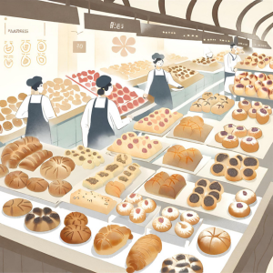

import { Editor } from '../../../../../../src/algorithms/editor/editor'

# 2. Busca de Doces na Padaria



Em uma padaria movimentada repleta de uma variedade encantadora de doces, cada doce é rotulado com um código único. A
padeira Sarah precisa encontrar um doce específico na prateleira. Dado um array representando os códigos dos doces na
padaria, ajude a padeira Sarah a encontrar o índice do doce com o código especificado.

Se o código especificado não for encontrado, retorne -1.

:::note

Este problema também pode ser resolvido por busca linear, mas certifique-se de resolvê-lo usando busca binária.

:::

```typescript
const docesDaPadaria = [
  'CroissantBanana', 'CroissantButtery', 'CroissantCaramel', 'Croissant2022', 'CroissantFlaky',
  'CroissantHazelnut', 'CroissantAlmond', 'CroissantOrange', 'CroissantGourmet', 'CroissantApricot',
  'DanishAlmond', 'DanishApricot', 'DanishCinnamon', 'DanishGourmet', 'DanishHazelnut',
  'DanishOrange', 'DanishButtery', 'DanishChocolate', 'DanishCranberry', 'DanishLemon',
  'EclairChocolate', 'EclairCoconut', 'EclairDelight', 'EclairMango', 'EclairRaspberry',
  'EclairButterscotch', 'EclairCaramel', 'EclairPineapple', 'EclairSpecial', 'EclairVanilla',
  'MacaronCoffee', 'MacaronHazelnut', 'MacaronLavender', 'MacaronPistachio', 'MacaronRose',
  'MacaronCinnamon', 'MacaronSpecial', 'MacaronVanilla', 'MacaronBlueberry', 'MacaronOrange',
  'SconeBlueberry', 'SconeCherry', 'SconeCranberry', 'SconeLemon', 'SconePeach',
  'SconeStrawberry', 'SconeChocolate', 'SconeCinnamon', 'SconeVanilla', 'SconeHazelnut'
]
const codigoDoDoce = 'SconeLemon'
encontrarIndiceDoDoce(docesDaPadaria, codigoDoDoce)
// Saída Esperada: Índice do doce com código SconeLemon (43)
```

<Editor
  editorHeight={450}
  args="['CroissantBanana', 'CroissantButtery', 'CroissantCaramel', 'Croissant2022', 'CroissantFlaky','CroissantHazelnut', 'CroissantAlmond', 'CroissantOrange', 'CroissantGourmet', 'CroissantApricot', 'DanishAlmond', 'DanishApricot', 'DanishCinnamon', 'DanishGourmet', 'DanishHazelnut','DanishOrange', 'DanishButtery', 'DanishChocolate', 'DanishCranberry', 'DanishLemon','EclairChocolate', 'EclairCoconut', 'EclairDelight', 'EclairMango', 'EclairRaspberry','EclairButterscotch', 'EclairCaramel', 'EclairPineapple', 'EclairSpecial', 'EclairVanilla','MacaronCoffee', 'MacaronHazelnut', 'MacaronLavender', 'MacaronPistachio', 'MacaronRose','MacaronCinnamon', 'MacaronSpecial', 'MacaronVanilla', 'MacaronBlueberry', 'MacaronOrange','SconeBlueberry', 'SconeCherry', 'SconeCranberry', 'SconeLemon', 'SconePeach','SconeStrawberry', 'SconeChocolate', 'SconeCinnamon', 'SconeVanilla', 'SconeHazelnut'], 'SconeLemon'"
  expectedResult="43"
  initialCode={`function encontrarIndiceDoDoce (docesDaPadaria: string[], codigoDoDoce: string): number {
  return -1
}`} />
