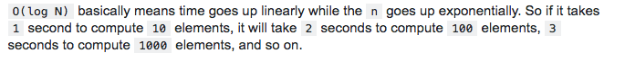
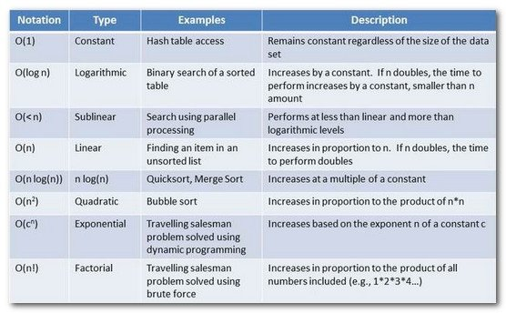
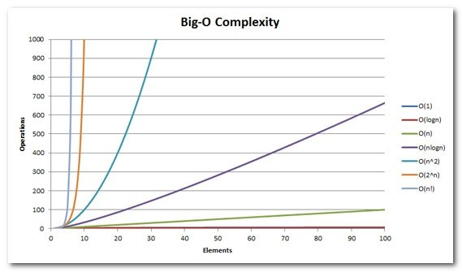

## Referências

- [The Art of Computer Programming - Donald Knuth](https://www.amazon.com.br/Computer-Programming-Volumes-1-4a-Boxed/dp/0321751043/ref=sr_1_1?qid=1575407297&refinements=p_lbr_books_authors_browse-bin%3ADonald+E.+Knuth&s=books&sr=1-1)
- [Clean Code: A Handbook of Agile Software Craftsmanship - Robert C. Martin Series](https://www.amazon.com.br/dp/B001GSTOAM/ref=dp-kindle-redirect?_encoding=UTF8&btkr=1)
- [The Mythical Man-Month: Essays on Software Engineering](https://www.amazon.com.br/Mythical-Man-Month-Anniversary-Software-Engineering-ebook/dp/B00B8USS14/ref=sr_1_1?__mk_pt_BR=%C3%85M%C3%85%C5%BD%C3%95%C3%91&crid=11LSVPQBNSMUS&keywords=the+mythical+man-month+essays+on+software+engineering&qid=1568834047&s=gateway&sprefix=The+Mythical+Man-Month%3A+Essays+on+Software+Engineering%2Caps%2C338&sr=8-1)
- [Eletrônica – Para Autodidatas, Estudantes e Técnicos – 2ª Edição, de Gabriel Torres](https://pay.hotmart.com/U8059089S?checkoutMode=10&utm_source=site&utm_medium=link&utm_content=link&utm_campaign=organico&sck=site&bid=1584206239824)
- [Rob Pike's 5 Rules of Programming](https://users.ece.utexas.edu/~adnan/pike.html)
- https://martinfowler.com/
- [Livro Clean Architecture - Uncle Bob](https://imasters.com.br/back-end/introducao-clean-architecture)
- [Teach Yourself Programming in Ten Years - Peter Norvig](http://norvig.com/21-days.html)
- [Coding Interview University](https://github.com/jwasham/coding-interview-university)
- [Teach Yourself CS](https://teachyourselfcs.com/)
- [Web Developer Roadmap](https://github.com/kamranahmedse/developer-roadmap)

## Princípios
- “Software ruim que adicionar valor > Software perfeito que não adiciona valor.”
- “Aprenda a dizer: Eu NÃO Sei, e caso necessário, procure aprender.”
- “Otimização prematura: a raiz de todo mal.”
- “Lembre-se que os dinossauros quase sempre são as melhores referências.”
- “Quem pensa pouco, erra muito” - Leonardo da Vinci
- “Em Deus eu confio. Todos os outros devem trazer dados.”
- “Falta de dinheiro é a raíz de todo mal.”
- “Não existe bala de prata.”
- “Fazer funcionar > Fazer de forma correta.”
- “Aumentar receitas > diminuir custos.”
- “SaaS > PaaS > IaaS > In-House”
- “Você != Unicórnio”
- “Sempre tente entender o que está acontecendo debaixo dos panos.”
- “Escrever código != programar != engenharia de software”
- “Manutenção > Perfomance”
- “Sem métricas, sem otimização”
- “Nunca pare de questionar”
- “Engenharia de software é 80% PENSANDO sobre o problema, e 20% COMO resolver o problema.”
- “Quanto mais conhecimento você tiver, menos você sabe. EGO = 1 / conhecimento.”
- “Todo mundo deveria se importar com qualidade”
- “Pelo menos 80% do código de um bom software foi refeito, diminuido ou melhor ainda, deletado. Menos é mais.”
- “2+2 não é 5, não importa quantas pessoas digam isso.”
- “Princípios > Analogia.”
- “Converse e aprenda com pessoas mais inteligentes do que você.”
- “Sempre tente usar a única fonte da verdade.”
- “Não reinvente a roda. É para isso que existe frameworks e bibliotecas prontas.”
- “Sempre é bom estudar uma ferramenta profundamente antes de colocar em produção.”
- “Modularização é tudo.”
- “Bons artistas copiam, grandes artistas roubam.”
- “Inovação só existe em um mundo de restrição, e não abundância.”
- “Sempre vai existir alguma coisa para melhorar. Feito é melhor que perfeito.”

## Clean Architecture
- 

## HTTP
<ul>
<li><a href="https://hpbn.co">High Performance Browser Networking </a></li>
<li><a href="https://http2.github.io/http2-spec/">Hypertext Transfer Protocol Version 2 (HTTP/2)</a></li>
<li><a href="https://www.youtube.com/watch?v=r5oT_2ndjms&t=10s">HTTP/2 101 (Chrome Dev Summit 2015)</a></li>
<li><a href="https://developers.google.com/web/fundamentals/performance/http2?hl=pt-br">Introdução a HTTP/2 Google Developers</a></li>
<li><a href="https://developer.mozilla.org/pt-BR/docs/Web/HTTP">https://developer.mozilla.org/pt-BR/docs/Web/HTTP</a></li>
<li><a href="https://pt.wikipedia.org/wiki/Lista_de_campos_de_cabe%C3%A7alho_HTTP">Lista de campos de cabeçalho HTTP</a></li>
<li><a href="https://www.youtube.com/watch?v=d_5iZJ8p9x8">Protocolo HTTP em detalhes #2 - Teoria</a></li>
<li><a href="https://www.casadocodigo.com.br/products/livro-desconstruindo-web">Livro: Desconstruindo a Web - As tecnologias por trás de uma requisição</a></li>
<li><a href="https://www.youtube.com/watch?v=GrHtpPksUF4">Sérgio Lopes - [Web.br 2015] HTTP/2</a></li>
<li><a href="https://www.youtube.com/watch?v=EMCBd3kw4zs">Sérgio Lopes - Desafios práticos de performance Web - BrazilJS Conf 2016</a></li>
<li><a href="https://kinsta.com/pt/blog/http3/">O Que É HTTP/3 – A Verdade Sobre o Novo Protocolo Baseado em UDP</a></li>
<li><a href="https://kinsta.com/pt/aprenda/http2/">O que é HTTP/2 – O Guia Final</a></li>
</ul>

## Microservices
<ul>
<li><a href="https://martinfowler.com/microservices/">https://martinfowler.com/microservices/</a></li>
<li><a href="http://blog.cleancoder.com/uncle-bob/2015/05/28/TheFirstMicroserviceArchitecture.html">http://blog.cleancoder.com/uncle-bob/2015/05/28/TheFirstMicroserviceArchitecture.html</a></li>
<li><a href="https://martinfowler.com/articles/microservices.html">https://martinfowler.com/articles/microservices.html</a></li>
<li><a href="https://www.redhat.com/pt-br/topics/microservices">https://www.redhat.com/pt-br/topics/microservices</a></li>
<li><a href="https://www.redhat.com/pt-br/topics/microservices/what-are-microservices">https://www.redhat.com/pt-br/topics/microservices/what-are-microservices</a></li>
</ul>
<p>Microsserviços são uma abordagem de arquitetura para a criação de aplicações. O que diferencia a arquitetura de microsserviços das abordagens monolíticas tradicionais é como ela decompõe a aplicação por funções básicas. Cada função é denominada um serviço e pode ser criada e implantada de maneira independente. Isso significa que cada serviço individual pode funcionar ou falhar sem comprometer os demais.</p>

<p>Pense na última vez em que você acessou o site de uma loja. Provavelmente, você usou a barra de pesquisa do site para procurar produtos. Essa pesquisa representa um serviço. Talvez você também tenha visto recomendações de produtos relacionados, extraídas de um banco de dados das preferências dos compradores. Isso também é um serviço. Você adicionou algum item ao carrinho de compras? Isso mesmo, esse é mais um serviço.</p>

<p>Quais são os benefícios da arquitetura de microsserviços?</p>
<p>Com os microsserviços, suas equipes e tarefas rotineiras podem se tornar mais eficientes por meio do desenvolvimento distribuído. Além disso, é possível desenvolver vários microsserviços ao mesmo tempo. Isso significa que você pode ter mais desenvolvedores trabalhando simultaneamente na mesma aplicação, o que resulta em menos tempo gasto com desenvolvimento.</p>
<ul>
<li>Lançamento no mercado com mais rapidez => Como os ciclos de desenvolvimento são reduzidos, a arquitetura de microsserviços é compatível com implantações e atualizações mais ágeis.</li>
<li>Altamente escalável => À medida que a demanda por determinados serviços aumenta, você pode fazer implantações em vários servidores e infraestruturas para atender às suas necessidades.</li>
<li>Resiliente => Os serviços independentes, se construídos corretamente, não afetam uns aos outros. Isso significa que, se um elemento falhar, o restante da aplicação permanece em funcionamento, diferentemente do modelo monolítico.</li>
<li>Fácil de implementar => Como as aplicações baseadas em microsserviços são mais modulares e menores do que as aplicações monolíticas tradicionais, as preocupações resultantes dessas implantações são invalidadas. Isso requer uma coordenação maior, mas as recompensas podem ser extraordinárias.</li>
<li>Acessível => Como a aplicação maior é decomposta em partes menores, os desenvolvedores têm mais facilidade para entender, atualizar e aprimorar essas partes. Isso resulta em ciclos de desenvolvimento mais rápidos, principalmente quando também são empregadas as tecnologias de desenvolvimento ágil.</li>
<li>Mais open source => Devido ao uso de APIs poliglotas, os desenvolvedores têm liberdade para escolher a melhor linguagem e tecnologia para a função necessária.</li>
</ul>

## Twelve Factor App
<ul>
<li>I. Base de Código -> Uma base de código com rastreamento utilizando controle de revisão, muitos deploys</li>
<li>II. Dependências -> Declare e isole as dependências</li>
<li>III. Configurações -> Armazene as configurações no ambiente</li>
<li>IV. Serviços de Apoio -> Trate os serviços de apoio, como recursos ligados</li>
<li>V. Build, release, run -> Separe estritamente os builds e execute em estágios</li>
<li>VI. Processos -> Execute a aplicação como um ou mais processos que não armazenam estado</li>
<li>VII. Vínculo de porta -> Exporte serviços por ligação de porta</li>
<li>VIII. Concorrência -> Dimensione por um modelo de processo</li>
<li>IX. Descartabilidade -> Maximizar a robustez com inicialização e desligamento rápido</li>
<li>X. Dev/prod semelhantes -> Mantenha o desenvolvimento, teste, produção o mais semelhante possível</li>
<li>XI. Logs -> Trate logs como fluxo de eventos</li>
<li>XII. Processos de Admin -> Executar tarefas de administração/gerenciamento como processos pontuais</li>
</ul>

## Algoritmos e Estrutura de Dados

 - YouTube
    - [Linguagem C Programação Descomplicada](https://www.youtube.com/user/progdescomplicada/videos)
 - Sites
    - [GeeksForGeeks](https://www.geeksforgeeks.org/)
    - [AssemblyProgressivo.net](https://www.assemblyprogressivo.net/)
- Treinamento de Código
    - [Project Euler](https://projecteuler.net/)
    - [HackerRank](https://www.hackerrank.com/)
    - [Edabit](https://edabit.com)
    - [URI Online Judge](https://www.urionlinejudge.com.br/judge/en/login)
- KhanAcademy 
   - [Computer Science](https://www.khanacademy.org/computing/computer-science)
   - [Notação assintótica](https://pt.khanacademy.org/computing/computer-science/algorithms/asymptotic-notation/a/asymptotic-notation)
- Recursão :skull:
   - [O que é recursão? Teste de Mesa com Fatorial - Softblue](https://www.youtube.com/watch?v=V60g61dhKmg)
- Visualização de Estruturas de Dados :skull:
   - [VisualGo](https://visualgo.net/en)
   - [University of San Francisco - CS](https://www.cs.usfca.edu/~galles/visualization/Algorithms.html)
- Big O Notation :skull: 
   - [bigocheatsheet.com](http://bigocheatsheet.com/)
   - [A coffee-break introduction to time complexity of algorithms](https://dev.to/vickylai/a-coffee-break-introduction-to-time-complexity-of-algorithms-160m?utm_source=digest_mailer&utm_medium=email&utm_campaign=digest_email)
   - O(1) Constant Time
      - Melhor caso possível
      - Se um algoritmo possui tempo constante, significa que sempre vai levar o mesmo tempo para produzir o resultado.
      - Exemplo: array.pop() -> tirar último item de um array, independente do tamanho, levará sempre o mesmo tempo!
   - Logarithms O(log n)
      - Preferível na maioria das vezes
      - Logaritimos são o inverso da exponenciação.
      - Exemplo: Algoritmo de busca binária -> dividir para conquistar
      - 
   - Linear time O(n)
      - Preferível na maioria das vezes
      - Se um algoritmo possui tempo linear, significa que o tempo de execução aumenta linearmente de acordo com o tamanho do input.
      - Exemplo: array.forEach() soma de todos os valores
   - Linear Logarithms O(n log n)
      - Aceitável
      ```
      x = n
      while ( x > 0 ) {
        y = x
        while ( y > 0 ) {
           y = y / 2
        }
        x -= 1
      }
      ```
      - Examples: Quicksort, Mergesort and Heapsort  -> dividir para conquistar
   - Quadratic time O(n²) :skull:
      - Bom evitar
      - O tempo de execução desse algoritmo é diretamente proporcional ao o quadrado do input.
      - Ou seja: 2->4  3->9  4->16  5->25 etc
      - Exemplo: Soma de matrizes
      ```
      for (var outer = 0; outer < elements.Count; outer++){
        for (var inner = 0; inner < elements.Count; inner++){
          ...
        }
      }
      ```
   - Exponential Time O(2^n) :skull: :skull:
      - Um dos piores casos, sempre é bom evitar
      - Indica um algoritmo cujo crescimento dobra a cada adição ao conjunto de dados de entrada. A curva de crescimento de uma função O (2N) é exponencial - começando muito rasa e depois subindo meteoricamente
      - Exemplo: recursive calculation of Fibonacci numbers
      ```
      int Fibonacci(int number){
          if (number <= 1) return number;
          return Fibonacci(number - 2) + Fibonacci(number - 1);
      }
      ```
   - Factorial Time O(n!) :skull: :skull: :skull:
     - Pior caso possível, sempre tente evitar!
     - Extremamente não perfomático
     - Vai executar em tempo fatorial para cada operação
     - Exemplo: Problema do vendedor viajante
        - "Dada uma lista de cidades e as distâncias entre cada par de cidades, qual é o caminho mais curto possível que visita cada cidade e retorna à cidade de origem?"
   - <strong>Resumo</strong>
      - 
      - 

## Segurança da Informação

 - Sites
    - [OWASP](https://www.owasp.org/index.php/Main_Page)
    - [EUGDPR.org](https://eugdpr.org/)
    - [LGPD - Lei Geral de Proteção de Dados Pessoais](http://www.planalto.gov.br/ccivil_03/_Ato2015-2018/2018/Lei/L13709.htm)
    - [Haveibeenpwned](https://haveibeenpwned.com/)
    - [Livro - Fundamentos de Engenharia Reversa - Mente Binária](https://mentebinaria.gitbook.io/engenharia-reversa/antes-de-comecar)
    - [Forum CaveiraTech](https://caveiratech.com/forum/)
    - [Oauth2](https://oauth.net/2/)
    - [Practical Cryptography for Developers - Free Book](https://cryptobook.nakov.com/)
 - Videos
    - [Gabriel Pato](https://www.youtube.com/channel/UC70YG2WHVxlOJRng4v-CIFQ)
    - [CaveiraTech](https://www.youtube.com/user/caveiratech2/playlists)
    - [Curso de Engenharia Reversa Online - Papo Binário](https://www.youtube.com/watch?v=IkUfXfnnKH4&list=PLIfZMtpPYFP6zLKlnyAeWY1I85VpyshAA)
 - Cursos 
    - [Fundamentos de Ethical Hacking - Udemy](https://www.udemy.com/fundamentos-de-ethical-hacking/learn/v4/)
    - [Solyd.com.br](https://solyd.com.br)
    - [Técnicas de Invasão](https://tecnicasdeinvasao.com/)
    - [Desenvolimento de Software Seguro - Curso Online Gratuito - ICA Instituto ](https://desenvolvimentoseguro.icainstituto.com.br/)
 - [DAT Protocol](https://www.datprotocol.com/)
    - [DatProject.org](https://datproject.org)
    - [Try Dat](https://try-dat.com/)
 - Banco de dados
    - World's Fastest Password Cracker
       - [HashCat](https://hashcat.net/hashcat/)
       - [HashKiller](https://hashkiller.co.uk/md5-decrypter.aspx)
    - Encriptação Recomendada
       - [Argon2](https://github.com/P-H-C/phc-winner-argon2)
       - [PBKDF2](https://en.wikipedia.org/wiki/PBKDF2)
       - [Scrypt](https://en.wikipedia.org/wiki/Scrypt)
       - [BCrypt](https://en.wikipedia.org/wiki/Bcrypt)
    - Não Recomendado :skull:
       - [MD5](https://pt.wikipedia.org/wiki/MD5)
       - [SHA1](https://www.thesslstore.com/blog/difference-sha-1-sha-2-sha-256-hash-algorithms/)
       - [SHA2](https://www.thesslstore.com/blog/difference-sha-1-sha-2-sha-256-hash-algorithms/)
       - [SHA256](https://www.thesslstore.com/blog/difference-sha-1-sha-2-sha-256-hash-algorithms/)
 - Ferramentas
    - Operation Systems
       - [Kali Linux](https://www.kali.org/)
       - [Tails Linux](https://tails.boum.org/index.pt.html)
    - Virtual Machines for Pentest
       - [PentesterLab](https://www.pentesterlab.com/exercises/)
       - [PentestBox](pentestbox.org)
          - [tools.pentestbox.org](https://tools.pentestbox.org/)
    - Transport Layer Security/Secure Sockets Layer
       - [Let's Encrypt](https://letsencrypt.org/)
    - Softwares
       - [WireShark](https://www.wireshark.org/)
       - [AngryIP Scanner](https://angryip.org/)
       - [metasploit](https://www.metasploit.com/)
	   - DataBases
	      - [Exploit-DB](https://www.exploit-db.com/)
	      - [SQLMap](http://sqlmap.org/)
	   - Useful CLI Commands
	      - [$ nmap site_url](https://nmap.org/)
	      - [$ traceroute site_url](https://www.lifewire.com/traceroute-linux-command-4092586)
        - [$ nmap localhost](https://nmap.org/)
	      - [$ curl site_url](https://curl.haxx.se/)
	      - [$ whafw00f site_url](https://github.com/EnableSecurity/wafw00f)
	      - [$ ping site_url](https://www.wikiwand.com/en/Ping)
	      - [$ host site_url](https://www.computerhope.com/unix/host.htm)
	      - [$ whois site_url](https://who.is/)
	   - Browsers
	      - [DuckDuckGo](https://duckduckgo.com)
	      - [Bernes Lee Solid](https://solid.mit.edu/)
	      - [Beaker Browser](https://beakerbrowser.com)
	      - [TorProject](https://www.torproject.org/)
	         - [TheHiddenWiki](https://thehiddenwiki.org/)
          
## Programação Funcional
  - [Aprender Haskell será um grande bem para você](http://haskell.tailorfontela.com.br/)

## Open Source
  - [OpenSource.org](https://opensource.org/)
  - [OpenSource.guide](https://opensource.guide/)
  - [Creative Commons](https://creativecommons.org/)
  - [Scrum Poker Online](https://scrumpoker.online/)